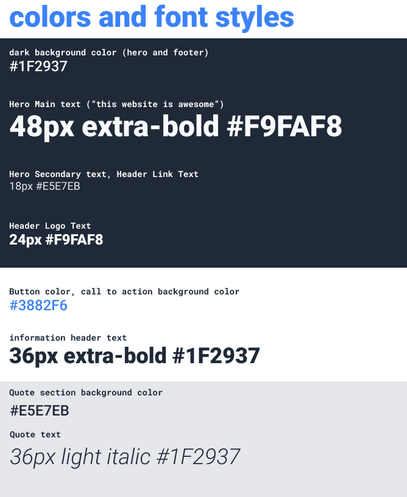

# Landing Page

## Overview

This repository contains my solution for the Landing Page assignment from The Odin Project. The goal of this project is to create a web page from a provided design, applying HTML and CSS skills learned in previous lessons. This assignment challenges students to build a complete web page layout, focusing on structure, styling, and visual design.

## Project Purpose

The purpose of this project is to:

- Practice creating a web page from a static design.
- Apply HTML and CSS skills in a practical context.
- Understand the process of translating a visual design into code.
- Enhance problem-solving and researching skills by figuring out how to implement various design elements.

## Current state

The website now looks like the design reference. However, it still needs improvements such as adding images and a more personalized touch.

## Fun Version: Kazama Family Landing Page

In addition to the original landing page, I created a fun version themed around the Kazama family from Yakuza 0. This version features content and styles inspired by the Yakuza game series. You can view this version [here](shalakushka.github.io/landing-page/yakuza/yakuza.html).

## Design References

### Full Design

### Fonts and Colors

